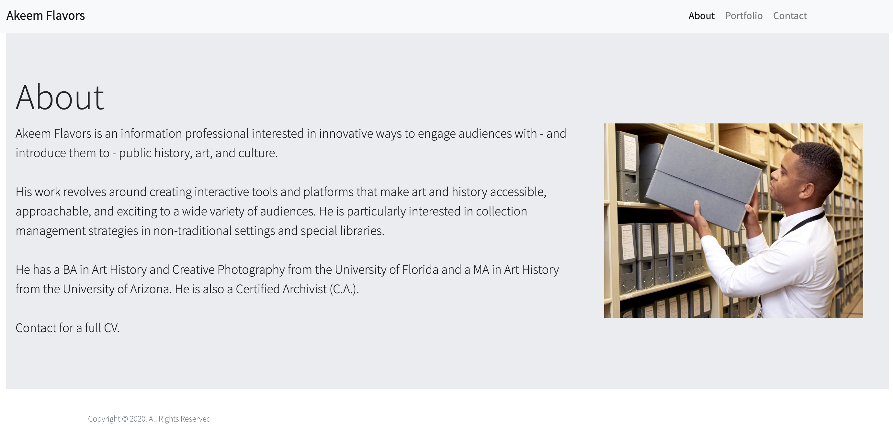

# 2-Responsive-Portfolio

This document provides a high-level overview of how this website is set up.

## Table of Contents
- [Overview](#Overview)
- [Notes](#Notes)
- [Credits](#Credits)

### Overview
This website was created to serve as the foundation for a responsive, personal portfolio.

### Notes
- This website was created using the latest version of Bootstrap (v4.4.1)

HTML
- Portfolio: The portfolio items outlined in the grid card do not currently have dedicated webpages. Content is expected to be updated.
- Contact: Links to social media lead to main website for the respective platforms. I do not yet have an account for every platform.

CSS
- The CSS is linked using an external style sheet

### Credits
Created by @aflavors. Feel free to contact me! :v: